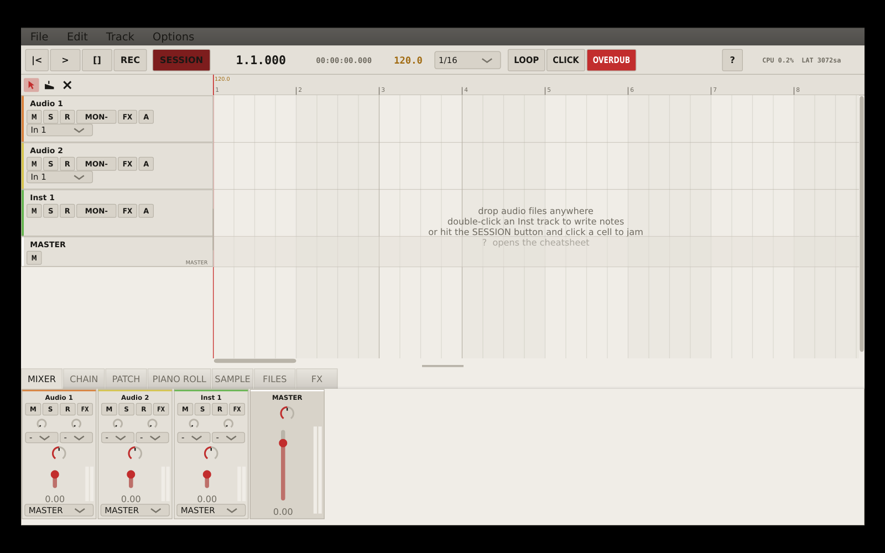
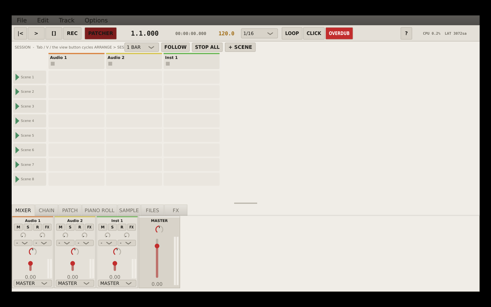
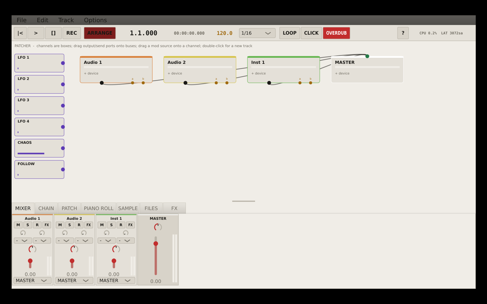

# HIKIM

HIKIM is a cross-platform experimental DAW built with JUCE 8, C++20 and CMake.
It is a mega-beta: barely tested, very much work in progress, and meant for
experiments before serious sessions.

The current shape:

- **TEETH**: an optional experimental effects rack. With every module off it must
  pass audio bit-identically.
- **WIRES / NODES**: a Max-style patcher that runs as an effect/instrument device and,
  at session scope, as the **PATCHER** — a node graph that taps, injects into and
  modulates any track (`chan~`, `master~`, `sample~`, `grain~`, `lfo~`, `pset`, …).
- **Three views over one project tree**: ARRANGE, SESSION and PATCHER, in a
  Bitwig-style horizontal layout whose side/bottom panels can detach to their own windows.
- **Clean by default**: tracks stay normal unless you add devices or routing.

Project page: <https://willbearfruits.github.io/hikim/>



## Downloads

Latest prebuilt artifacts are on the
[releases page](https://github.com/willbearfruits/hikim/releases/latest):

| Platform | File | Notes |
| --- | --- | --- |
| Windows | [HIKIM-setup.exe](https://github.com/willbearfruits/hikim/releases/latest/download/HIKIM-setup.exe) | Installer; bundles ffmpeg, installs per-user (no admin). |
| Windows | [HIKIM-windows-portable.zip](https://github.com/willbearfruits/hikim/releases/latest/download/HIKIM-windows-portable.zip) | Portable `HIKIM.exe` + bundled ffmpeg. |
| Linux x86_64 | [HIKIM-linux-x86_64.tar.gz](https://github.com/willbearfruits/hikim/releases/latest/download/HIKIM-linux-x86_64.tar.gz) | Portable binary (uses system `ffmpeg` on PATH). |

These are mega-beta builds: barely tested, changing quickly, and not something to
trust with irreplaceable work. Keep backups of sessions and source audio.

## Screenshots

| Arrange | Session | Patcher/Routing |
| --- | --- | --- |
|  |  |  |

## What Works

- Timeline editing with audio/MIDI tracks, split, ripple delete, nudge, duplicate,
  undo/redo, loop selection and drag/drop import.
- Session grid with quantized clip and scene launching, follow/tracker-style scene
  chaining, slot waveforms and BPM detect/conform.
- TEETH experimental effects rack with module ordering, macros, MIDI learn and rack state.
- WIRES patcher with oscillators, filters, delay feedback, host `param` bridge and
  OSC in/out.
- Plugin hosting for VST3 everywhere, AU on macOS and LV2 where supported by JUCE.
- Built-in instruments: RUST, GRAVEL, HYMN and the WIRES instrument path.
- Mixer, channel chain, modulation patch bay, piano roll, sample editor, file bin
  and FX browser.
- Offline export, stems, stretch cache, ffmpeg-backed media decode fallback and
  XML project files (`*.dgproj`).

## Quick Start

### Linux artifact

```sh
tar -xzf dist/HIKIM-linux-x86_64.tar.gz
./HIKIM
```

### Windows artifact

Run `dist/HIKIM-setup.exe`, or unzip `dist/HIKIM-windows-portable.zip` and launch
`HIKIM.exe`.

### From source

Requirements:

- CMake 3.22 or newer
- C++20 compiler
- JUCE 8.0.13, supplied by `-DJUCE_SOURCE_DIR`, `./JUCE`, `/opt/JUCE`, or fetched by CMake

Linux dependencies:

```sh
sudo apt install build-essential cmake libasound2-dev libjack-jackd2-dev \
    libfreetype-dev libx11-dev libxcomposite-dev libxcursor-dev libxext-dev \
    libxinerama-dev libxrandr-dev libxrender-dev libfontconfig1-dev \
    libcurl4-openssl-dev libgl1-mesa-dev
```

Build:

```sh
cmake -B build -DCMAKE_BUILD_TYPE=Release
cmake --build build -j$(nproc)
./build/dawglitch_artefacts/Release/HIKIM
```

Windows:

```bat
cmake -B build -G "Visual Studio 17 2022"
cmake --build build --config Release
build\dawglitch_artefacts\Release\HIKIM.exe
```

macOS:

```sh
cmake -B build -DCMAKE_BUILD_TYPE=Release -G Xcode
cmake --build build --config Release -j
open "build/dawglitch_artefacts/Release/HIKIM.app"
```

## Controls

- **Space/K**: play or stop.
- **J/L**: jump one bar, Shift for four bars.
- **Return**: return to start.
- **R**: record.
- **Shift+L**: loop on/off.
- **Ctrl+L**: loop around selection.
- **S**: split at playhead.
- **Delete**: delete selected clips.
- **Shift+Delete**: ripple delete.
- **Ctrl+X/C/V/D/A**: cut, copy, paste, duplicate, select all.
- **Ctrl+T / Ctrl+Shift+T**: new audio or MIDI track.
- **Ctrl+Z / Ctrl+Shift+Z**: undo or redo.
- **Ctrl+N/O/S/E**: new, open, save, export.
- **Tab / V / view button**: cycle ARRANGE, SESSION and PATCHER views.
- **1/2/3**: select, razor and erase tools.
- **F1**: help.

Most editing surfaces have context menus. Right-click clips, track headers, the
ruler, automation lanes, rack knobs and session slots.

## Project Model

`SessionModel` owns one JUCE `ValueTree`, saved as XML `.dgproj`. All UI and engine
state changes go through that tree so undo, views and the audio graph stay in sync.

Time conventions:

- timeline positions and lengths: double seconds
- MIDI notes: beats relative to clip start
- audio clip offset: source-file samples
- realtime engine snapshots: engine samples at the current sample rate

Read [`ARCHITECTURE.md`](ARCHITECTURE.md) for the full graph and subsystem notes.

## Testing

The headless suite covers model operations, clip editing, comp crossfades, TEETH/WIRES
passthrough behavior, built-in instruments and the stretch cache. That helps catch
obvious regressions, but this is still barely tested public software.

```sh
cmake --build build --target ruin_tests -j$(nproc)
./build/ruin_tests_artefacts/Release/ruin_tests
```

Crashes write a backtrace to `hikim-crash.log` in the system temp directory.

## Extension Points

Deliberate growth points are marked with `// EXTEND:` in the source. The next
owner-approved roadmap work is Phase C: recording into session slots and capturing a
session jam back into the arrangement.

Names live in `Source/Common.h`: `dg::names::appName`, `rackName`, `patcherName`,
plus `PRODUCT_NAME` in `CMakeLists.txt`.

## License

HIKIM is free software, released under the **GNU Affero General Public License v3**
(see [LICENSE](LICENSE)). It is built on [JUCE](https://juce.com) (AGPLv3) and the
[Rubber Band Library](https://breakfastquay.com/rubberband/) (GPL).
